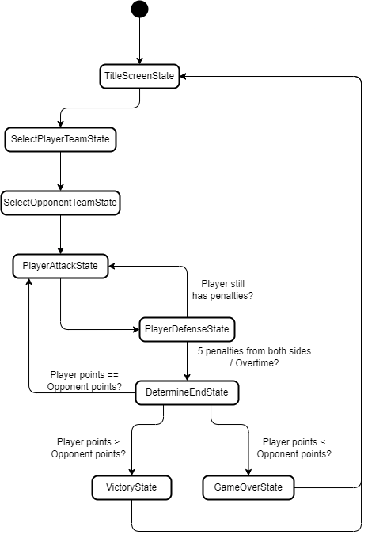

# Game Programming F22 Project - World Cup 2022 Penalty shoot-out

## ✒️ Description

It's the World Cup 2022 Finals. The player's favorite team is playing against the player's least favorite team. Both teams are tied in score after the normal time and extra time have expired, therefore they must do a penalty shoot-out. For the penalty shots, each team must shoot five penalties. Determined to win, the player must beat their opponent team in this sports genre game by scoring more goals than them.

## 🕹️ Gameplay

Before the game begins, the player must select their team as well as the opponent team. Once they have selected the teams, the player will start the first penalty shot. To shoot, they will have to use their cursor and click on a location that is inside of the goal. Depending on where they click, they will either score a goal, get blocked by the goalee, hit the post or completely miss the goal. If they do score the goal, they will gain a point.

The penalty shots alternate between the player's team and the opponent team. During the opponent's turn, the player will have to block the shot from the opponent. They will be able to see where the opponent will shoot one second right before the opponent kicks the ball, meaning they will have to quickly click on that spot to block. If the opponent scores a goal, they will gain a point. If the player blocks the goal, the opponent does not gain a point. If the opponent misses the goal or hits the post, they will not gain a point.

The winner will be decided based on which team has the higher score. If both teams shoot all five penalty shots and they are in a tie, then the game will enter a "sudden death" mode, where whoever scores a goal first wins.

## 📃 Requirements

1. The user shall choose their team.
2. The user shall choose the opponent team.
3. The user shall shoot the first penalty kick.
4. The user shall click where they want to shoot the ball.
5. The AI shall either block or not block the ball based on a certain chance.
6. If the user scores a goal, the system shall award the player one point.
7. The system shall alternate the penalty shots between the player and the opponent (five turns each).
8. After a player shoots, the system shall end their turn and start their opponent's turn.
9. If it's the opponent's turn, the user shall select where to block on the goal.
11. The AI shall shoot in a random location inside of the goal based on random number generation (RNG).
10. The user shall see where the opponent will shoot one second before they kick the ball.
13. If the AI scores a goal, the system shall award the opponent one point.
14. At the end of the match, if the user has more points, the user shall win.
15. At the end of the match, if the opponent has more points, the user shall lose.
16. At the end of the match, if there is a tie, the system will enter a "sudden death" mode, where the first team to score will win.

### 🤖 Game State Diagram

### 🗺️ Class Diagram

- The difference between the Goal class' _dimensions_ and _goalNetDimensions_ is that (_dimensions_ - _goalNetDimensions_) will be the goal post (or crossbar) and the _goalNetDimensions_ is where the soccer ball can go inside the goal.
- The _OpponentFactory_ is responsible for instantiating the opponent team. It is a service class that provides different values for each opponent's _chanceOfAttack_ and _chanceOfDefense_ depending on the team selected.

### 🧵 Wireframes

- _TEAM X_ is an option which the player can select for their team or the opponent's team.
- There will be a total of 16 teams, depending on how the World Cup 2022 goes (top 16 teams).
- The colors will be replaced with a flag representing the country of the team.

This is the main UI of the game, where the player will shoot their penalty shot, as well as block the opponent's penalty shot (The Player and Opponent will switch after every penalty shot).

### 🎨 Assets

I used [app.diagrams.net](https://app.diagrams.net/) to create the state diagrams, class diagram and wireframes. Wireframes are the equivalent to the skeleton of a web app since they are used to describe the functionality of the product and the users experience.

#### 🖼️ Images

- Player, Opponent and Ball sprites will come from [Players and Ball](https://pixeljoint.com/pixelart/87697.htm).
- For the soccer ball rolling sprites, I will just rotate the original soccer ball sprite.
- Goal and Background sprite will come from [Goal and Background](https://www.vecteezy.com/vector-art/12067294-pixel-art-soccer-goal-field).

#### ✏️ Fonts

For fonts, I will use a font very similar to the font used in the actual World Cup. Since the context of the game is the finals of the World Cup 2022, it would be nice to match with the actual event!

- [World Cup Font](https://fontsrepo.com/wrold-cup-2022-free-font/)

#### 🔊 Sounds

Some of the other sound effects are free sounds that come from [freesound.org](https://freesound.org).
- Hovering Over an Option: [Hover](https://freesound.org/people/broumbroum/sounds/50561/)
- Selecting an Option: [Select](https://freesound.org/people/dland/sounds/320181/)
- Game Start: [Start](https://freesound.org/people/plasterbrain/sounds/243020/)
- Kicking the ball: [Ball Kick](https://freesound.org/people/volivieri/sounds/37156/)
- Blocking the ball: [Ball Block](https://freesound.org/people/13GPanska_Lakota_Jan/sounds/378355/)
- Player scores or blocks the ball: [Success](https://freesound.org/people/shinephoenixstormcrow/sounds/337049/)
- Player misses or does not block the ball [Fail 1](https://freesound.org/people/martcraft/sounds/651626/) or [Fail 2](https://freesound.org/people/Raclure/sounds/483598/)
- Ball hitting the goal post: [Goal Post](https://freesound.org/people/Ryanz-Official/sounds/639760/)
- Ball going inside the goal: [Ball Inside Net](https://freesound.org/people/bigal13/sounds/654482/)

I don't know if this will be a problem, but I would like to use a couple sound effects and songs from [YouTube](https://www.youtube.com/). Here they are:
- When the player scores a goal, [Ronaldo - SIU](https://www.youtube.com/watch?v=6zcDsQQQ738) will play
- When the opponent scores a goal, [Fail Sound Effect](https://www.youtube.com/watch?v=hckIjL7z5z4) will play
- Title screen Song: [IShowSpeed - World Cup Song](https://www.youtube.com/watch?v=0O8pHgKZAvQ)
- Background song during the penalty shots: [IShowSpeed - World Cup Song (Instrumental)](https://www.youtube.com/watch?v=oFn69_OkYXE) or [Vegedream - Ramenez La Coupe A La Maison (Instrumental)](https://www.youtube.com/watch?v=I5RiEx_vvY4) or [Vegedream - Ramenez La Coupe A La Maison](https://www.youtube.com/watch?v=RHb5LKnnxLg)
- Victory Song: [Queen - We Are The Champions](https://www.youtube.com/watch?v=04854XqcfCY)
- Defeat Song: [One Piece - Mother Sea](https://www.youtube.com/watch?v=o231fOo8cNg) (I will probably find a better song and change this)

If possible, I would really like to use these sounds. One of the main reasons I wanted to go with the soccer concept is to use these songs sounds.

### 📚 References

- [World Cup 2022 Teams](https://www.fifa.com/fifaplus/en/tournaments/mens/worldcup/qatar2022/teams)
- [Penalty shoot-out](https://en.wikipedia.org/wiki/Penalty_shoot-out_(association_football))